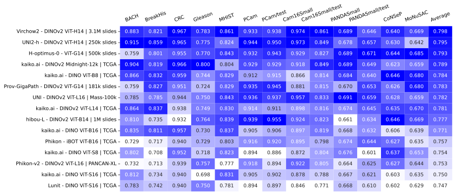

<div align="center">

<br />


<br />
<br />

_Oncology FM Evaluation Framework by kaiko.ai_

[](https://pypi.python.org/pypi/kaiko-eva)
[](https://kaiko-ai.github.io/eva/latest)
[](https://github.com/kaiko-ai/eva#license)<br>
[](https://openreview.net/forum?id=FNBQOPj18N&noteId=FNBQOPj18N)

<p align="center">
  <a href="https://github.com/kaiko-ai/eva#installation">Installation</a> •
  <a href="https://github.com/kaiko-ai/eva#how-to-use">How To Use</a> •
  <a href="https://github.com/kaiko-ai/eva#quick-start">Quick Start</a> •
  <a href="https://kaiko-ai.github.io/eva/">Documentation</a> •
  <a href="https://kaiko-ai.github.io/eva/dev/datasets/">Datasets</a> •
  <a href="https://github.com/kaiko-ai/eva#benchmarks">Benchmarks</a> <br>
  <a href="https://github.com/kaiko-ai/eva#contributing">Contribute</a> •
  <a href="https://github.com/kaiko-ai/eva#acknowledgements">Acknowledgements</a>
</p>

</div>

<br />

_`eva`_ is an evaluation framework for oncology foundation models (FMs) by [kaiko.ai](https://kaiko.ai/).
Check out the [documentation](https://kaiko-ai.github.io/eva/) for more information.

### Highlights:
- Easy and reliable benchmark of Oncology FMs
- Supports patch-level classification, slide-level classification, semantic segmentation, and text classification downstream tasks
- Automatic embedding inference and evaluation of a downstream task
- Native support of popular medical [datasets](https://kaiko-ai.github.io/eva/dev/datasets/) and models
- Produce statistics over multiple evaluation fits and multiple metrics

## Installation

Simple installation from PyPI:
```sh
# to install the core version only
pip install kaiko-eva

# to install the expanded `vision` version
pip install 'kaiko-eva[vision]'

# to install the expanded `language` version
pip install 'kaiko-eva[language]'

# to install everything
pip install 'kaiko-eva[all]'
```

To install the latest version of the `main` branch:
```sh
pip install "kaiko-eva[all] @ git+https://github.com/kaiko-ai/eva.git"
```

You can verify that the installation was successful by executing:
```sh
eva --version
```

## How To Use

_`eva`_ can be used directly from the terminal as a CLI tool as follows:
```sh
eva {fit,predict,predict_fit} --config url/or/path/to/the/config.yaml 
```

_`eva`_ uses [jsonargparse](https://jsonargparse.readthedocs.io/en/v4.31.0/) to
make it easily configurable by automatically generating command line interfaces (CLIs),
which allows to call *any* Python object from the command line. Moreover, the configuration structure is always in sync with the code. Thus, _`eva`_ can be used either directly from Python or as a CLI tool (recommended).

For more information, please refer to the [documentation](https://kaiko-ai.github.io/eva/dev/user-guide/tutorials/offline_vs_online/).

<details>
  <summary>Learn about Configs</summary>

The following interfaces are identical:
<table>
<tr>
<th>Python interface</th>
<th>Configuration file</th>
</tr>
<tr>
<td>
<sub>

```Python
# main.py
# execute with: `python main.py`

from torch import nn

from eva import core
from eva.vision import datasets, transforms

# initialize trainer
trainer = core.Trainer(max_steps=100)

# initialize model
model = core.HeadModule(
  backbone=nn.Flatten(),
  head=nn.Linear(150528, 4),
  criterion=nn.CrossEntropyLoss(),
)

# initialize data
data = core.DataModule(
  datasets=core.DatasetsSchema(
    train=datasets.BACH(
      root="data/bach",
      split="train",
      download=True,
      transforms=transforms.ResizeAndCrop(),
    ),
  ),
  dataloaders=core.DataloadersSchema(
    train=core.DataLoader(batch_size=32),
  ),
)

# perform fit
pipeline = core.Interface()
pipeline.fit(trainer, model=model, data=data)
```
</sub>
<td>
<sub>

```yaml
# main.yaml
# execute with: `eva fit --config main.yaml`

---
trainer:
  class_path: eva.Trainer
  init_args:
    max_steps: 100
model:
  class_path: eva.HeadModule
  init_args:
    backbone: torch.nn.Flatten
    head:
      class_path: torch.nn.Linear
      init_args:
        in_features: 150528
        out_features: 4
    criterion: torch.nn.CrossEntropyLoss
data:
  class_path: eva.DataModule
  init_args:
    datasets:
      train:
        class_path: eva.vision.datasets.BACH
        init_args:
          root: ./data/bach
          split: train
          download: true
          transforms: eva.vision.transforms.ResizeAndCrop
    dataloaders:
      train:
        batch_size: 32
```
</sub>
</td>
</tr>
</table>

The `.yaml` file defines the functionality of _`eva`_
by parsing and translating its content to Python objects directly.
Native supported configs can be found at the
[configs](https://github.com/kaiko-ai/eva/tree/main/configs) directory
of the repo, which can be both locally stored or remote.

</details>

## Quick Start

We define two types of evaluations: **online** and **offline**.
While online fit uses the backbone (FM) to perform forward passes
during the fitting process, offline fit first generates embeddings
with the backbone and then fits the model using these embeddings as
input, resulting in a faster evaluation.

Here are some examples to get you started:

- Perform a downstream offline **classification** evaluation of `DINO ViT-S/16`
on the `BACH` dataset with linear probing by first pre-calculating the embeddings:
  ```sh
  DOWNLOAD_DATA=true \
  MODEL_NAME=universal/vit_small_patch16_224_dino \
  eva predict_fit --config https://raw.githubusercontent.com/kaiko-ai/eva/main/configs/vision/pathology/offline/classification/bach.yaml
  ```

- Perform a downstream online **segmentation** evaluation of `DINO ViT-S/16` on the `MoNuSAC` dataset with the `ConvDecoderWithImage` decoder:
  ```sh
  DOWNLOAD_DATA=true \
  MODEL_NAME=universal/vit_small_patch16_224_dino \
  eva fit --config https://raw.githubusercontent.com/kaiko-ai/eva/main/configs/vision/pathology/online/segmentation/monusac.yaml
  ```

By default `eva` will perform 5 evaluation runs using different seeds, however, you can control the number of runs through the `N_RUNS` environment variable or in the configuration file. The results will be saved to `./logs` by default, or to `OUTPUT_ROOT` if specified.

For more examples, take a look at the [configs](https://github.com/kaiko-ai/eva/tree/main/configs)
and [tutorials](https://kaiko-ai.github.io/eva/main/user-guide/advanced/replicate_evaluations/).

> [!NOTE]
> All the datasets that support automatic download in the repo have by default the option to automatically download set to false.
> For automatic download you have to manually set the environment variable `DOWNLOAD_DATA=true` or in the configuration file `download=true`.

## Leaderboards

The following table shows the FMs we have evaluated with _`eva`_. For more detailed information about the evaluation process, please refer to our [documentation](https://kaiko-ai.github.io/eva/main/leaderboards/).




## Contributing

_`eva`_ is an open source project and welcomes contributions of all kinds. Please checkout the [developer](./docs/DEVELOPER_GUIDE.md)
and [contributing guide](./docs/CONTRIBUTING.md) for help on how to do so.

All contributors must follow the [code of conduct](./docs/CODE_OF_CONDUCT.md).


## Acknowledgements

Our codebase is built using multiple opensource contributions

<div align="center">

[](https://github.com/pre-commit/pre-commit)
[](https://pytorch.org/get-started/locally/)
[](https://pytorchlightning.ai/)<br>
[](https://black.readthedocs.io/en/stable/)
[](https://pycqa.github.io/isort/)
[](https://github.com/astral-sh/ruff)
[](https://microsoft.github.io/pyright/)<br>
[](https://pdm-project.org)
[](https://github.com/wntrblm/nox)
[](https://squidfunk.github.io/mkdocs-material/)

</div>


## Citation

If you find this repository useful, please consider giving a star ⭐ and adding the following citation:

```bibtex
@inproceedings{kaiko.ai2024eva,
    title={eva: Evaluation framework for pathology foundation models},
    author={kaiko.ai and Ioannis Gatopoulos and Nicolas K{\"a}nzig and Roman Moser and Sebastian Ot{\'a}lora},
    booktitle={Medical Imaging with Deep Learning},
    year={2024},
    url={https://openreview.net/forum?id=FNBQOPj18N}
}
```

<br />

<div align="center">
  
</div>
