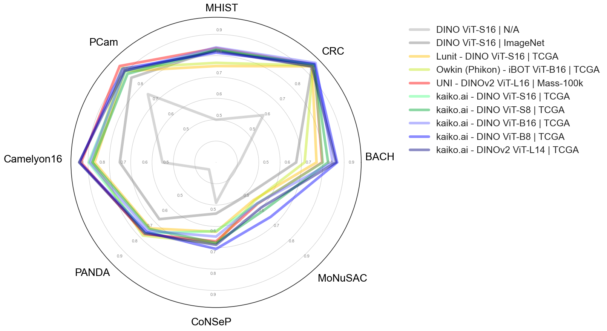

---
hide:
  - navigation
---

# Leaderboards

We evaluated the following FMs on the 6 supported WSI-classification tasks. We report *Balanced Accuracy* for binary & multiclass tasks and generalized Dice score (no background) for segmentation tasks. The score shows the average performance over 5 runs.

 

 

 

The runs use the default setup described in the section below.

*eva* trains the decoder on the "train" split and uses the "validation" split for monitoring, early stopping and checkpoint selection. Evaluation results are reported on the "test" split if available and otherwise on the "validation" split.

For details on the FM-backbones and instructions to replicate the results, check out [Replicate evaluations](user-guide/advanced/replicate_evaluations.md). For information on the tasks, check out [Datasets](datasets/index.md).

## Evaluation protocol

*eva* uses a task- & model-independent and fixed default set up which closely follows the standard evaluation protocol proposed by [1] (with adjustments for slide-level tasks to ensure convergence and computational efficiency).

We selected this approach to prioritize reliable, robust and fair FM-evaluation while being in line with common literature.

|                                | WSI patch-level classification tasks | WSI slide-level classification tasks | WSI patch-level segmentation tasks |
|--------------------------------|---------------------------|---------------------------|---------------------------|
| **Backbone**                   | frozen                    | frozen                    | frozen                    |
| **Head**                       | single layer MLP          | ABMIL                     | Mult-stage convolutional  |
| **Dropout**                    | 0.0                       | 0.0                       | 0.0                       |
| **Hidden activation function** | n/a                       | ReLU                      | n/a                       |
| **Output activation function** | none                      | none                      | none                      |
| **Number of steps**            | 12,500                    | 12,500 (2)                | 2,000                     |
| **Base batch size**            | 4,096 (1)                 | 32                        | 64                        |
| **Base learning rate**         | 0.01 (1)                  | 0.001                     | 0.0001                    |
| **Early stopping**             | 5% * [Max epochs]         | 10% * [Max epochs] (3)    | 10% * [Max epochs] (3)    |
| **Optimizer**                  | SGD                       | AdamW                     | AdamW                     |
| **Momentum**                   | 0.9                       | n/a                       | n/a                       |
| **Weight Decay**               | 0.0                       | n/a                       | n/a                       |
| **betas**                      | n/a                       | [0.9, 0.999]              | [0.9, 0.999]              |
| **LR Schedule**                | Cosine without warmup     | Cosine without warmup     | PolynomialLR              |
| **Loss**                       | Cross entropy             | Cross entropy             | Dice                      |
| **number of patches per slide**| 1                         | dataset specific (4)      | dataset specific (4)      |

(1) For smaller datasets (e.g. BACH with 400 samples) we reduce the batch size to 256 and scale the learning rate accordingly.

(2) Upper cap at a maximum of 100 epochs.

(3) Lower cap at a minimum of 8 epochs.

(4) Number of patches per slide depends on task and slide size. E.g. for PANDA and Camelyon16 we use a max of 1,000 and 10,000 random patches per slide respectively.

- [1]: [Virchow: A Million-Slide Digital Pathology Foundation Model, 2024](https://arxiv.org/pdf/2309.07778.pdf)
