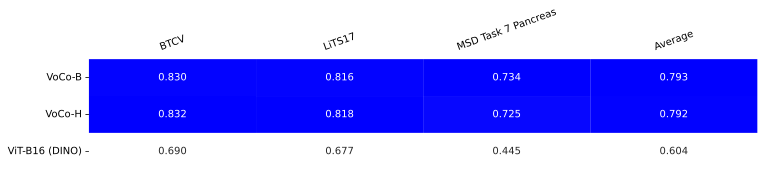

---
hide:
  - navigation
---

# Leaderboards

## Pathology

We evaluated the following FMs on a variety of WSI classification & segmentation tasks. We report *Balanced Accuracy* for binary & multiclass tasks and Dice Score (without background) for segmentation tasks. The score shows the average performance over 5 runs for patch-level classification & segmentation tasks, and 20 runs for slide-level (due to higher standard deviation among runs). Note the leaderboard orders from best to worst according to the average performance across all tasks, excluding BACH (not comparable due to uncommon MPP after resizing).

 

 

The runs use the default setup described in the section below.

*eva* trains the decoder on the "train" split and uses the "validation" split for monitoring, early stopping and checkpoint selection. Evaluation results are reported on the "test" split if available and otherwise on the "validation" split.

For details on the FM-backbones and instructions to replicate the results, check out [Replicate evaluations](user-guide/advanced/replicate_evaluations.md). For information on the tasks, check out [Datasets](datasets/index.md). For Camelyon16 runtime optimization we use only 1000 foreground patches per slide which impacts the performance on this benchmark accross all models. 

### Evaluation protocol

*eva* uses a fixed protocol customized to each category of tasks. The setup has proven to be performant and robust independent of task and model size & architecture and generally prioritizes fairness and comparability over state-of-the-art performance.

We selected this approach to prioritize reliable, robust and fair FM-evaluation while being in line with common literature.

|                                | WSI patch-level classification tasks | WSI slide-level classification tasks | WSI patch-level segmentation tasks |
|--------------------------------|---------------------------|---------------------------|---------------------------|
| **Backbone**                   | frozen                    | frozen                    | frozen                    |
| **Head**                       | single layer MLP          | ABMIL                     | upscaling + conv with input image (3) |
| **Dropout**                    | 0.0                       | 0.0                       | 0.0                       |
| **Hidden activation function** | n/a                       | ReLU                      | n/a                       |
| **Output activation function** | none                      | none                      | none                      |
| **Number of steps**            | 12,500                    | 12,500 (1)                | 2,000                     |
| **Base batch size**            | 256                       | 32                        | 64                        |
| **Base learning rate**         | 0.0003                    | 0.001                     | 0.002                     |
| **Early stopping**             | 20% * [Max epochs]        | 20% * [Max epochs]        | 20% * [Max epochs]        |
| **Optimizer**                  | AdamW                     | AdamW                     | AdamW                     |
| **Momentum**                   | 0.9                       | n/a                       | n/a                       |
| **Weight Decay**               | 0.0                       | n/a                       | n/a                       |
| **betas**                      | n/a                       | [0.9, 0.999]              | [0.9, 0.999]              |
| **Loss**                       | Cross entropy             | Cross entropy             | Dice                      |
| **number of patches per slide**| 1                         | dataset specific (2)      | dataset specific (2)      |

(1) Upper cap at a maximum of 100 epochs.

(2) Number of patches per slide depends on task and slide size. E.g. for `PANDASmall` and `Camelyon16Small` we use a max of 200 and 1000 random patches per slide respectively.

(3) Our custom segmentation decoder initially upsamples the input feature maps before concatenating them with the original input image, followed by a series of convolutional layers. Incorporating the input image is crucial to compensate for resolution loss in feature maps generated by architectures like ViT. Without this approach, models with smaller patch sizes would consistently outperform those with larger patch sizes in the leaderboard.

## Radiology

We evaluate both 2D and 3D FMs on different radiology segmentation tasks.
We report *Balanced Accuracy* for binary & multiclass tasks and Dice Score (without background) for segmentation tasks. The score shows the average performance over 5 runs. Note the leaderboard orders from best to worst according to the average performance across all tasks.

 

 

### Evaluation protocol

We use the following evaluation protocol for radiology tasks:

|                                | CT Scan Segmentation         |
|--------------------------------|------------------------------|
| **Backbone**                   | frozen                       |
| **Decoder**                    | `SwinUNETRDecoder` (1)       |
| **Training Steps**             | 20k-50k (task specific)      |
| **Batch size**                 | 8 crops from 2 CT scans (2)  |
| **Base learning rate**         | 0.001                        |
| **Optimizer**                  | AdamW                        |
| **Weight Decay**               | 0.01                         |
| **betas**                      | [0.9,0.999]                  |
| **Loss**                       | `DiceCELoss`                 |

After training, the checkpoint with the best validation dice score is selected.

(1) Hatamizadeh, Ali, et al. "Unetr: Transformers for 3d medical image segmentation." Proceedings of the IEEE/CVF winter conference on applications of computer vision. 2022. For big encoders such as `VoCo-H` be reduce the number of channels in the produced feature maps through 1x1 convolutions to reduce the number of parameters in the decoder and keep the size comparable to decoders for smaller encoders. For 2D baselines we use the same convolutional decoder as for the pathology tasks (see description above).

(2) We use 8 crops from 2 CT scans, where each crop is randomly sampled from the CT scan. The crops are randomly sampled from the CT scans, with the center corresponding to one of the class labels. The size of the crops depends on the backbone.